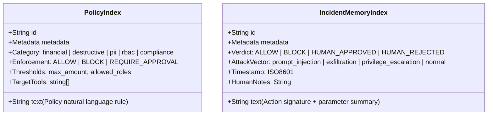
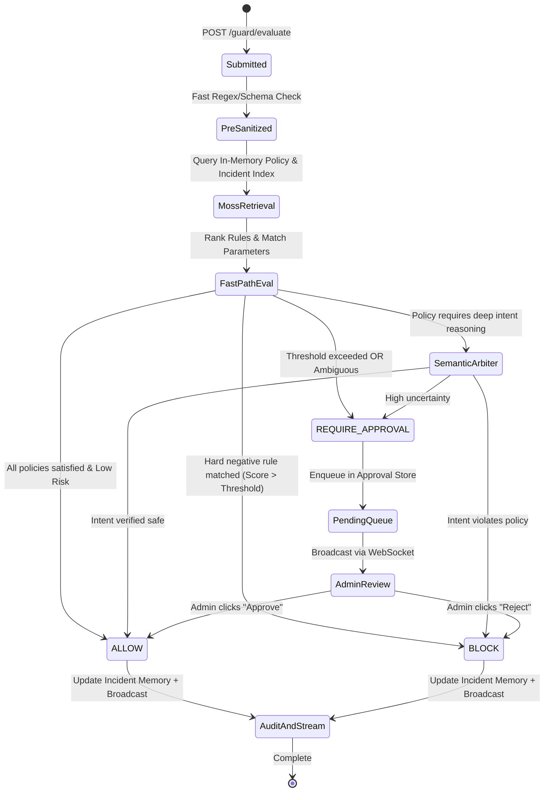

# AgentGuard — System Architecture Specification

> **YC Fall 2026 × Moss: Zero Latency Builder Sprint**  
> *Sub-10ms Security and Reliability Layer for Autonomous AI Agents*

---

## 1. Executive Summary & Problem Statement

### The Core Problem in Agentic AI
As AI agents transition from read-only chatbots to autonomous actors performing real-world actions (e.g., executing database queries, transferring funds, modifying cloud infrastructure, sending emails, processing PII), they introduce critical operational risks:
- **Prompt Injection & Jailbreaking:** Adversaries bypass system prompts via indirect injection in tool inputs.
- **Unauthorized Privilege Escalation:** Agents executing commands beyond their role permissions.
- **Catastrophic Parameter Drift:** Extreme numbers, invalid accounts, destructive flags (`DROP TABLE`, `rm -rf`).
- **Policy & Compliance Violations:** Violations of SOC2, HIPAA, GDPR, or internal corporate governance.

### The Latency Dilemma
To mitigate these risks, organizations attempt to insert security guardrails into the agent tool execution loop. However, conventional guardrails rely on remote vector databases (e.g., Pinecone, Qdrant, remote Chroma) to look up policies and past incidents:
- **Remote Vector Search:** 250ms – 600ms network round-trip.
- **Remote LLM Evaluator:** 800ms – 2,500ms inference time.
- **Total Latency Penalty:** **1.0s – 3.0s per tool call**.

In real-time voice agents, interactive copilots, and multi-step agent graphs, a 1–3 second penalty on every tool call destroys user experience and breaks conversational fluidity. Developers end up disabling guardrails in production.

### The AgentGuard Solution
AgentGuard embeds **Moss**—the sub-10ms in-process semantic search runtime—directly into the agent's hot execution path. By storing active policies, RBAC rules, negative constraints, and historical incident precedents in Moss in-memory indexes, AgentGuard retrieves relevant security context in **3–5ms**. Paired with a deterministic fast-path rule evaluation engine, AgentGuard delivers a verdict (**ALLOW**, **BLOCK**, or **REQUIRE_APPROVAL**) in **under 10ms**.

---

## 2. System Architecture Diagram

```mermaid
flowchart TD
    subgraph Agentic_Environment["Agentic Environment (LangChain / CrewAI / Voice Agent / Custom)"]
        Agent[Autonomous AI Agent]
        ToolRequest["Proposed Action / Tool Call\n(e.g., stripe_refund, db_query)"]
        Agent -->|1. Propose Action| ToolRequest
    end

    subgraph AgentGuard_Gateway["AgentGuard Security Gateway (FastAPI Backend)"]
        TriageEngine["Triage & Sanitizer\n(<1ms regex/schema)"]
        
        subgraph Moss_Runtime["Moss Sub-10ms In-Memory Runtime"]
            PolicyIndex[("Policy Index\n(Rules, RBAC, Limits)")]
            IncidentIndex[("Incident Memory\n(Past attacks, Approvals)")]
        end

        FastPath["Fast-Path Decision Engine\n(Deterministic Rules <2ms)"]
        SemanticArbiter["Optional Semantic Arbiter\n(High-Ambiguity Fallback)"]
        DecisionRouter{Verdict Router}
        AuditLogger[("Audit Log\nSQLite WAL")]
    end

    subgraph Frontend_Dashboard["Admin Dashboard (Vite/React - Built by Claude)"]
        RealtimeStream["Live Event Stream\n(WebSocket / SSE)"]
        ApprovalQueue["HITL Approval Queue"]
        TelemetryCharts["Latency & Threat Telemetry"]
    end

    subgraph External_Execution["Execution Destination"]
        SafeExecution["Execute Real Tool / API"]
        BlockedEvent["Drop / Raise SecurityException"]
    end

    ToolRequest -->|POST /guard/evaluate| TriageEngine
    TriageEngine -->|2. Parallel Query <5ms| Moss_Runtime
    PolicyIndex -->|Matched Policies| FastPath
    IncidentIndex -->|Similar Precedents| FastPath
    
    FastPath -->|Unambiguous Match| DecisionRouter
    FastPath -.->|Ambiguous / High Risk| SemanticArbiter
    SemanticArbiter -.-> DecisionRouter

    DecisionRouter -->|ALLOW (<10ms)| SafeExecution
    DecisionRouter -->|BLOCK (<10ms)| BlockedEvent
    DecisionRouter -->|REQUIRE_APPROVAL| ApprovalQueue

    DecisionRouter -->|Telemetry Event| RealtimeStream
    DecisionRouter -->|Record Log| AuditLogger
    ApprovalQueue -->|Admin Verdict: Approve/Reject| DecisionRouter
    AuditLogger -.->|Periodic Index Sync| IncidentIndex
```

---

## 3. High-Resolution Latency Budget (Target: <10ms Hot Path)

| Stage | Target Latency | Technology / Mechanism | Description |
| :--- | :--- | :--- | :--- |
| **1. Ingestion & Pre-check** | **0.5 – 1.0 ms** | FastAPI + Pydantic v2 | Payload deserialization, schema validation, regex syntax checks |
| **2. Moss Retrieval** | **3.0 – 5.0 ms** | Moss In-Memory Runtime | Local hybrid search (vector + BM25) across Policy & Incident indexes |
| **3. Fast-Path Evaluation** | **0.5 – 1.5 ms** | Python Native Rule Engine | Threshold checks (limits, roles, explicit blocks, exact parameter bounds) |
| **4. Telemetry & Response** | **0.5 – 1.0 ms** | Non-blocking AsyncIO | Async broadcast to WebSocket queue, return HTTP response |
| **Total Fast-Path Latency** | **4.5 – 8.5 ms** | **Sub-10ms Guarantee** | **Full security gate completed with zero user-noticeable lag** |
| *5. Semantic Arbiter (Optional)* | *100 – 200 ms* | Groq / Gemini Flash | Only invoked if policies explicitly require natural-language intent reasoning |

---

## 4. Moss Retrieval Integration Architecture

Moss is NOT treated as an external cloud database. It is embedded directly as an in-process search runtime via the `moss` Python SDK (`pip install moss`).

### Dual-Index Strategy
AgentGuard provisions and maintains two specialized Moss indexes loaded into memory on server startup:



### 1. `agentguard-policies` Index
- **Purpose:** Stores declarative enterprise security rules, compliance boundaries, and spending/rate limits.
- **Example Documents:**
  - *"Transactions over $1,000 require human admin approval."*  
    `{ category: "financial", tool: "stripe.*", action: "REQUIRE_APPROVAL", max_amount: 1000 }`
  - *"Never drop, truncate, or alter production tables without explicit SuperAdmin approval."*  
    `{ category: "destructive", tool: "db_query", action: "BLOCK", risk: "CRITICAL" }`
  - *"PII export containing SSN, credit cards, or passwords is strictly blocked."*  
    `{ category: "pii", tool: "crm_export", action: "BLOCK" }`
- **Query Mechanism:** When `tool_name: "stripe_transfer", params: { amount: 2500 }` arrives, AgentGuard queries Moss with `"stripe transfer $2500"` filtered by `category: "financial"`. Moss returns the top 3 rules within 3.5ms.

### 2. `agentguard-incidents` (Security Precedent Memory)
- **Purpose:** Vectorized memory of historical actions, attack payloads, and human approval verdicts.
- **Why It Matters:** Enables instant zero-shot and few-shot detection of repeated adversarial attacks, parameter manipulation, or past manual overrides.
- **Query Mechanism:** Vector similarity lookup of the action signature. If an agent tries a subtle SQL injection or role-spoofing attempt that resembles a blocked attack from yesterday, Moss retrieves the incident in 4ms, triggering an immediate **BLOCK**.

---

## 5. Decision Lifecycle & State Machine



---

## 6. Technology Stack & Component Responsibilities

| Component | Responsibility | Tech Choice |
| :--- | :--- | :--- |
| **API Gateway & Lifespan** | Handles HTTP/WS connections, lifespan index warmup, CORS | **FastAPI + Uvicorn (Python 3.11+)** |
| **Retrieval Engine** | In-process sub-10ms semantic search, BM25 + vector hybrid | **`moss` Python SDK (`MossClient`)** |
| **Resilience Layer** | In-memory fallback mock if credentials are not configured | **Custom In-Memory Vector & Rule Mock** |
| **Fast-Path Decision Engine** | Sub-millisecond deterministic policy evaluation | **Native Python Rule Evaluator** |
| **State & Persistence** | Audit log, approval queue, latency metrics history | **SQLite with WAL Mode (`aiosqlite`)** |
| **Live Telemetry Stream** | Broadcasts live evaluation events & approvals | **FastAPI WebSocket Manager** |
| **Frontend (Separate)** | Admin UI, HITL queue, Latency dashboard, Simulator | **Vite / React / Tailwind (Claude-built)** |
